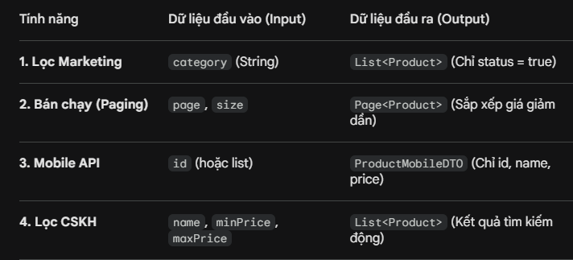
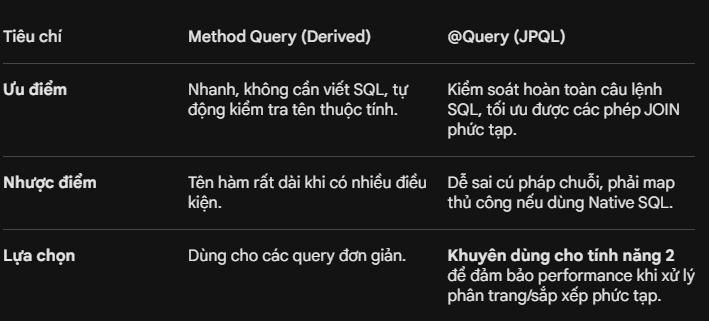

Request gửi tới Controller -> 2. Kiểm tra page: Nếu < 0 gán mặc định = 0 -> 3. Kiểm tra Giá: Nếu minPrice > maxPrice, thực hiện hoán đổi (swap) hoặc báo lỗi yêu cầu nhập lại -> 4. Gửi xuống Service.